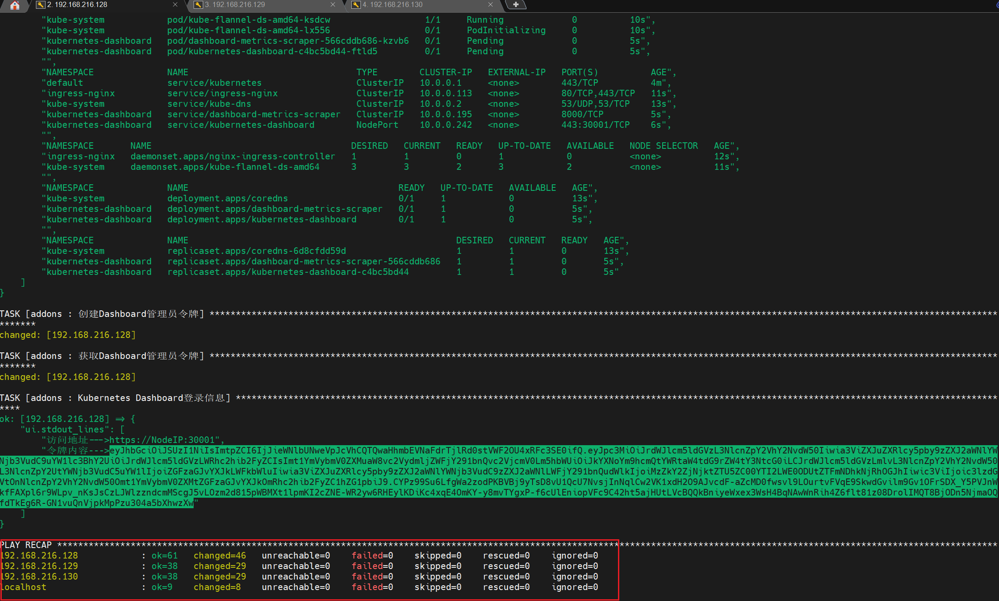

# K8s安装前期准备

- 域名解析
为了集群节点的直接调用，需要配置主机名解析，分别在三台服务器上编辑`/etc/hosts`

```
192.168.216.128 master
192.168.216.129 node01
192.168.216.130 node02
```

- 同步时间
集群中的事件必须精确一致，可以直接使用chronyd服务从网络同步时间，三台服务器均需做同样操作
```
systemctl start chronyd
systemctl enable chronyd
date

# 或者使用
ntpdate time.windows.com
```

- 禁用iptables和firewalld服务
kubernetes和docker在运行中会产生大量的iptables规则，为了不让系统规则和他们混淆，直接关闭系统规则。三台虚拟机均需做同样的操作
```
systemctl stop firewalld
systemctl disable firewalld

systemctl stop iptables
systemctl disable iptatbles
```

- 禁用selinux
selinux是linux系统下的一个安全服务，如果不关闭它，在安装集群中会产生各种各样的奇葩问题
```
# 永久关闭
sed -i 's/enforcing/disabled/' /etc/selinux/config


# 临时关闭
setenforce 0
```

- 禁止swap分区
swap分区指的是虚拟内存分区，它的作用是在物理内存使用完之后，将磁盘空间虚拟成内存来使用启用swap设备会对系统的性能产生非常负面的影响，因此kubernetes要求每个节点都要禁用swap设备但是如果因为某些原因确实不能关闭swap分区，就需要在集群安装过程中通过明确的参数进行配置说明

```
# 临时关闭
[root@master ~]# swapoff -a
# 永久关闭
[root@master ~]# vim /etc/fstab
```

- 修改linux的内核参数
我们需要修改linux的内核参数，添加网桥过滤和地址转发功能，编辑/etc/sysctl.d/kubernetes.conf文件，添加如下配置:
```
net.bridge.bridge-nf-call-ip6tables = 1
net.bridge.bridge-nf-call-iptables = 1
net.ipv4.ip_forward = 1

```

添加后进行的操作
```
# 重新加载配置
[root@master ~]# sysctl -p
# 加载网桥过滤模块
[root@master ~]# modprobe br_netfilter
# 查看网桥过滤模块是否加载成功
[root@master ~]# lsmod | grep br_netfilter
```

- 配置ipvs的功能
在kubernetes中service有两种代理模型，一种是基于iptables的，一种是基于ipvs的 相比较的话，ipvs的性能明显要高一些，但是如果要使用它，需要手动载入ipvs模块


```
# 安装ipset和ipvsadm
[root@master ~]# yum install ipset ipvsadmin -y

# 添加需要加载的模块写入脚本文件
[root@master ~]# cat <<EOF > /etc/sysconfig/modules/ipvs.modules
#!/bin/bash
modprobe -- ip_vs
modprobe -- ip_vs_rr
modprobe -- ip_vs_wrr
modprobe -- ip_vs_sh
modprobe -- nf_conntrack_ipv4
EOF
# 为脚本文件添加执行权限
[root@master ~]# chmod +x /etc/sysconfig/modules/ipvs.modules
# 执行脚本文件
[root@master ~]# /bin/bash /etc/sysconfig/modules/ipvs.modules
# 查看对应的模块是否加载成功
[root@master ~]# lsmod | grep -e ip_vs -e nf_conntrack_ipv4
```

- 完成后重启服务器
```
reboot
```


### 参考链接

(Kubernetes集群搭建)[https://zhuanlan.zhihu.com/p/363978095]


-------------------------------------------------


## 同步时间

## 在一台机器上安装ansible
```
yum install ansible -y
```
发现没有可用的软件包: ansible  
因此需要安装epel
```
yum install -y epel-release
```
安装后再执行
```
yum install ansible -y
```


把binary_pkg.tar.gz压缩包解压到/root目录下，并且把ansible-install-k8s的压缩包也解压到该目录下，然后执行`# ansible-playbook -i hosts single-master-deploy.yml -uroot -k --tags addons`即可

如果安装成功会出现如下图片

如下是该token

```
eyJhbGciOiJSUzI1NiIsImtpZCI6IjJieWNlbUNweVpJcVhCQTQwaHhmbEVNaFdrTjlRd0stVWF2OU4xRFc3SE0ifQ.eyJpc3MiOiJrdWJlcm5ldGVzL3NlcnZpY2VhY2NvdW50Iiwia3ViZXJuZXRlcy5pby9zZXJ2aWNlYWNjb3VudC9uYW1lc3BhY2UiOiJrdWJlcm5ldGVzLWRhc2hib2FyZCIsImt1YmVybmV0ZXMuaW8vc2VydmljZWFjY291bnQvc2VjcmV0Lm5hbWUiOiJkYXNoYm9hcmQtYWRtaW4tdG9rZW4tY3NtcG0iLCJrdWJlcm5ldGVzLmlvL3NlcnZpY2VhY2NvdW50L3NlcnZpY2UtYWNjb3VudC5uYW1lIjoiZGFzaGJvYXJkLWFkbWluIiwia3ViZXJuZXRlcy5pby9zZXJ2aWNlYWNjb3VudC9zZXJ2aWNlLWFjY291bnQudWlkIjoiMzZkY2ZjNjktZTU5ZC00YTI2LWE0ODUtZTFmNDhkNjRhOGJhIiwic3ViIjoic3lzdGVtOnNlcnZpY2VhY2NvdW50Omt1YmVybmV0ZXMtZGFzaGJvYXJkOmRhc2hib2FyZC1hZG1pbiJ9.CYPz99Su6LfgWa2zodPKBVBj9yTsD8vU1QcU7NvsjInNqlCw2VK1xdH2O9AJvcdF-aZcMD0fwsvl9LOurtvFVqE9SkwdGvilm9Gv1OFrSDX_Y5PVJnWkfFAXpl6r9WLpv_nKsJsCzLJWlzzndcmMScgJ5vLOzm2d815pWBMXt1lpmKI2cZNE-WR2yw6RHEylKDiKc4xqE4OmKY-y8mvTYgxP-f6cUlEniopVFc9C42ht5ajHUtLVcBQQkBniyeWxex3WsH4BqNAwWnRih4Z6flt81z08DrolIMQT8BjODn5NjmaOQfdTkEg6R-GN1vuQnVjpkMpPzu304a5bXhwzXw
```
