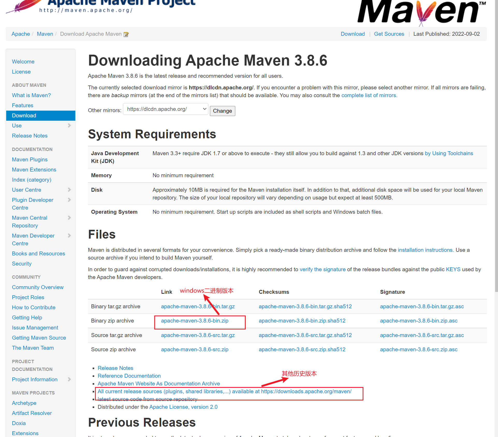
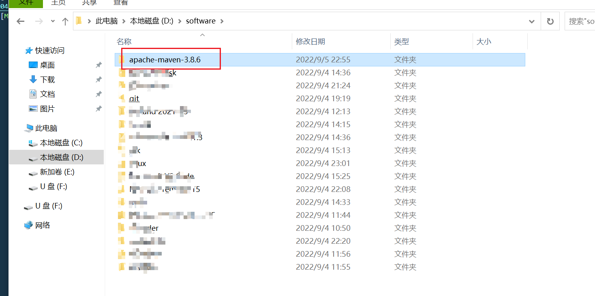
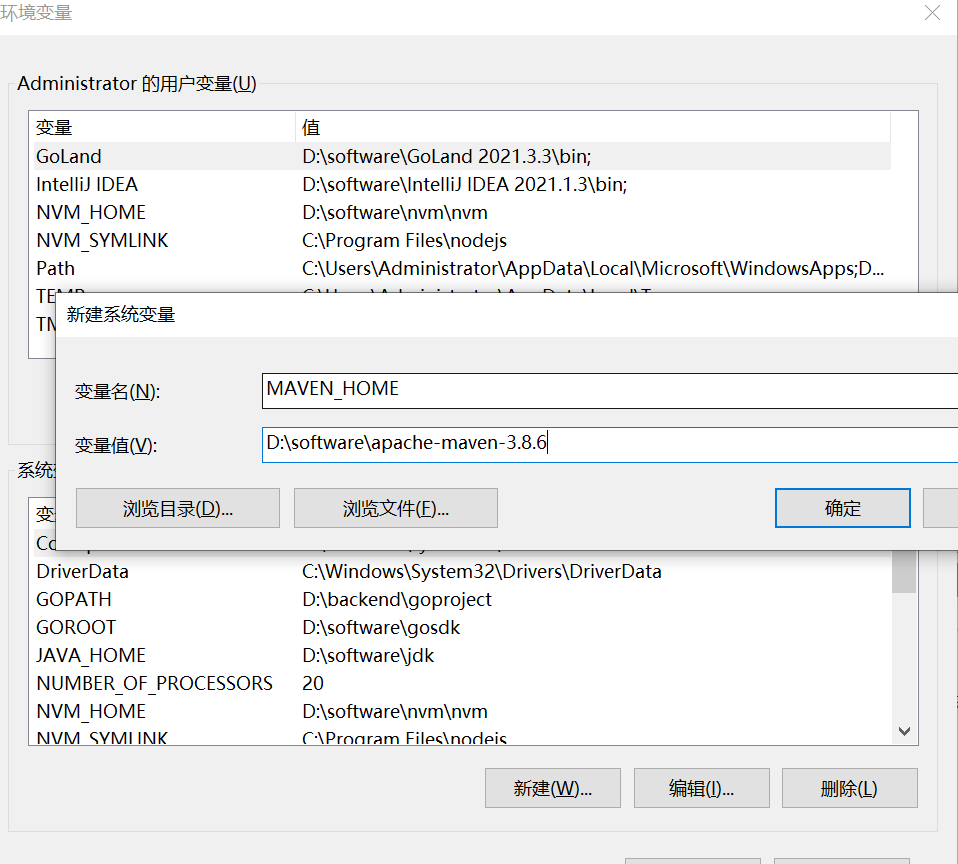
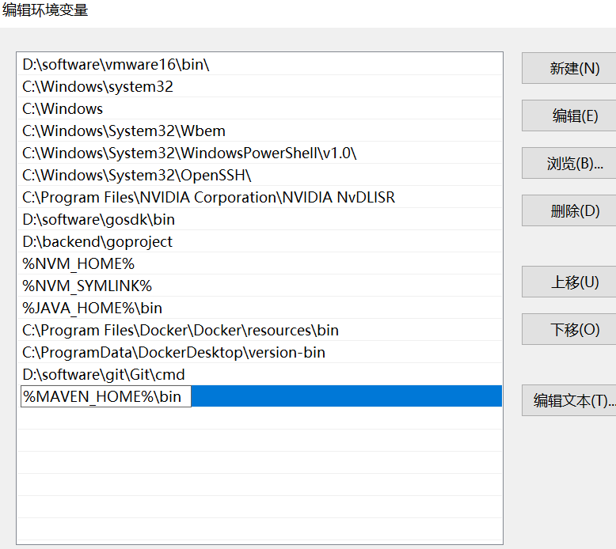
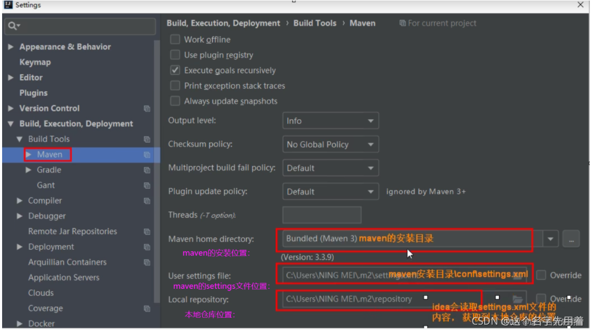
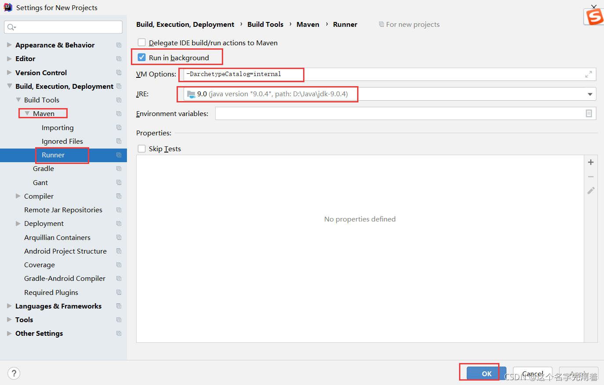

# Maven


## 安装

### 1.1 下载Maven

官网下载Maven: https://maven.apache.org/download.cgi
    


### 1.2 下载后选择一个路径进行解压



### 1.3 配置环境变量
然后把路径添加到环境变量中



### 1.4 验证
`mvn --version`出现即表示安装成功  
```
Apache Maven 3.8.6 (84538c9988a25aec085021c365c560670ad80f63)
Maven home: D:\software\apache-maven-3.8.6
Java version: 1.8.0_241, vendor: Oracle Corporation, runtime: D:\software\jdk\jre
Default locale: zh_CN, platform encoding: GBK
OS name: "windows 10", version: "10.0", arch: "amd64", family: "windows"
```
## 修改配置
配置文件在/conf目录下；需要修改的地方有三个：
1. 本地仓库
2. 镜像仓库
3. 配置jdk版本

### 2.1 修改本地仓库
1. 创建一个目录，不要太深，比如D:/backend/mavem-repo

2. 修改/conf/settings.xml

```xml
<localRepository>D:/backend/mavem-repo</localRepository>
```

### 2.2 配置阿里云镜像仓库
```xml
  <mirrors>
		<mirror>
            <id>alimaven</id>
            <mirrorOf>central</mirrorOf>
            <name>aliyun maven</name>
            <url>http://maven.aliyun.com/nexus/content/repositories/central/</url>
        </mirror>
  </mirrors>

```

### 2.3 配置jdk版本

```xml
<profiles>
  <!-- java版本编译 --> 
		<profile>
		<!-- 告诉maven我们用jdk1.9 --> 
			  <id>jdk-1.9</id>
			  <!-- 开启jdk的使用 --> 
			  <activation>
				<activeByDefault>true</activeByDefault>
				<jdk>1.9</jdk>
			  </activation>
			
			  <properties>
			  <!-- 配置编译器信息 -->
				<maven.compiler.source>1.9</maven.compiler.source>
				<maven.compiler.target>1.9</maven.compiler.target>
				<maven.compiler.compilerVersion>1.9</maven.compiler.compilerVersion>
			  </properties>
		</profile>
</profiles>
```

使用`mvn help:system`可以测试是否可以连接到阿里云仓库

## 在idea中配置maven

### 3.1 在Build Tools下的Maven设置maven的安装目录，maven的配置文件及maven的本地仓库


### 3.2 设置Maven下的Runner, 避免从网络中下载archetype-catalog.xml模板，从而加快下载速度



## 参考链接

1. [Maven的安装与配置-详细版](https://blog.csdn.net/weixin_38568503/article/details/121045947)
2. [Maven安装与配置](https://blog.csdn.net/qq_38190185/article/details/115921070)