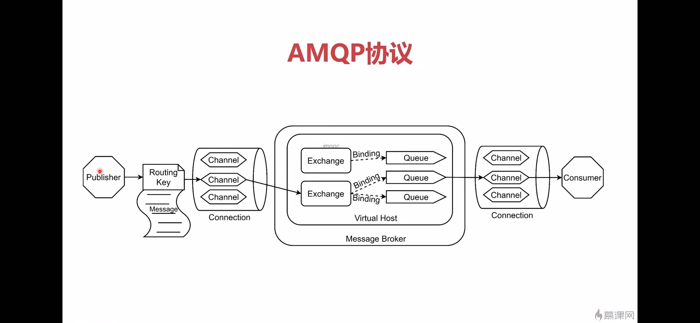
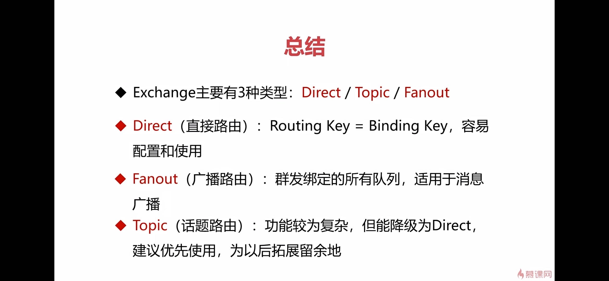
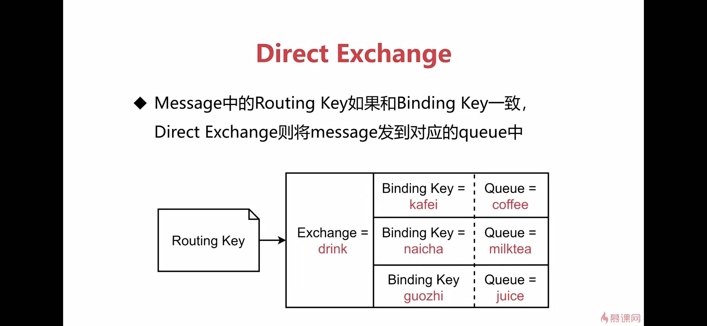
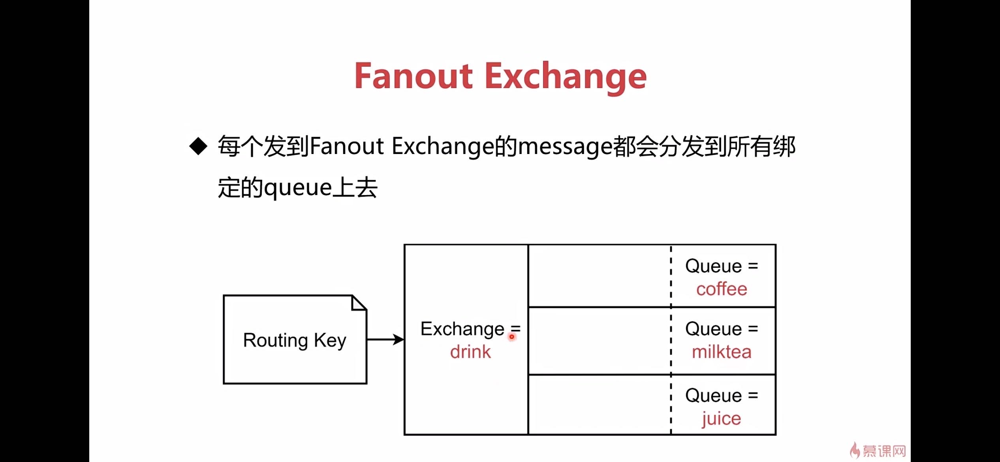
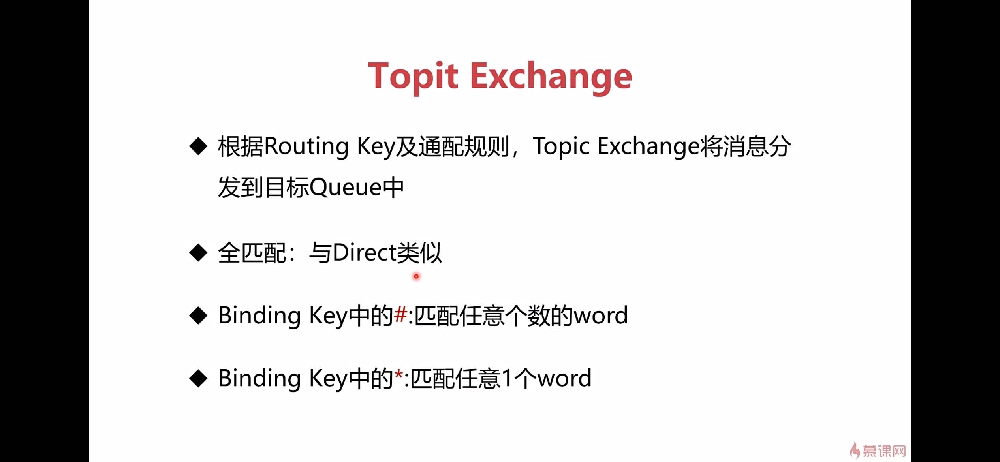

# RabbitMQ


## amqp协议




## exchange 交换机



exchange类型有direct、fanout、topic三种

### direct


### fanout




### topic




## 命令行工具rabbitmqctl
rabbitmq命令行可以用`--help`查看    


查看状态
```shell
rabbitmqctl status
```

查看绑定
```shell
rabbitmqctl list_bindings
```

查看channel
```shell
rabbitmqctl list_channels
```

查看connection
```shell
rabbitmqctl list_connections
```

查看消费者
```shell
rabbitmqctl list_consumers
```

查看交换机
```shell
rabbitmqctl list_exchanges
```

队列相关
```shell
# 查看队列
rabbitmqctl list_queues

# 删除队列
rabbitmqctl delete_queue

# 清空队列
rabbitmqctl purge_queue
```

用户相关
```shell
# 添加用户
rabbitmqctl add_user


# 修改用户密码
rabbitmqctl change_password

# 删除用户
rabbitmqctl delete_user

# 查看用户
rabbitmqctl list_users

# 设置用户角色
rabbitmqctl set_user_tags
```

应用相关
```shell
# 启动应用
rabbitmqctl start_app

# 关闭应用(保留Erlang虚拟机，暂停)
rabbitmqctl stop_app

# 关闭应用, 直接关闭
rabbitmqctl stop

```

集群相关
```shell

# 加入集群
rabbitmqctl join_cluster

# 离开集群
rabbitmqctl reset

```