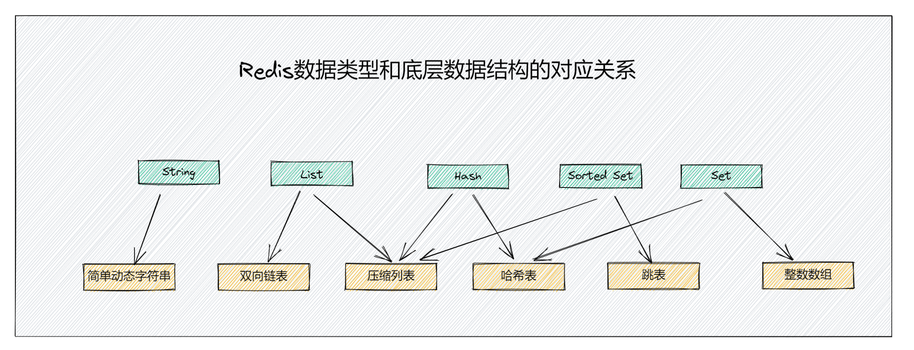

# Redis为什么快

Redis快的原因有两个：
1. 内存数据库，所有操作都在内存上完成；
2. 归结于底层的数据结构，采用键值对的方式对数据进行增删改查

## 底层数据结构
Redis的底层数据结构一共有6种，分别是动态字符串、双向链表、压缩列表、哈希表、跳表和整数数组, 如下图所示

### 哈希表
一个哈希表，其实就是一个数组，数组的每个元素称为一个哈希桶。所以我们常说，一个哈希表是由多个哈希桶组成的，每个哈希桶种保存了键值对数据。