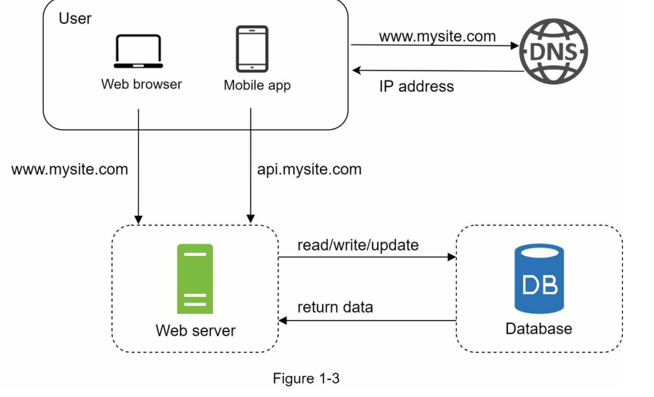
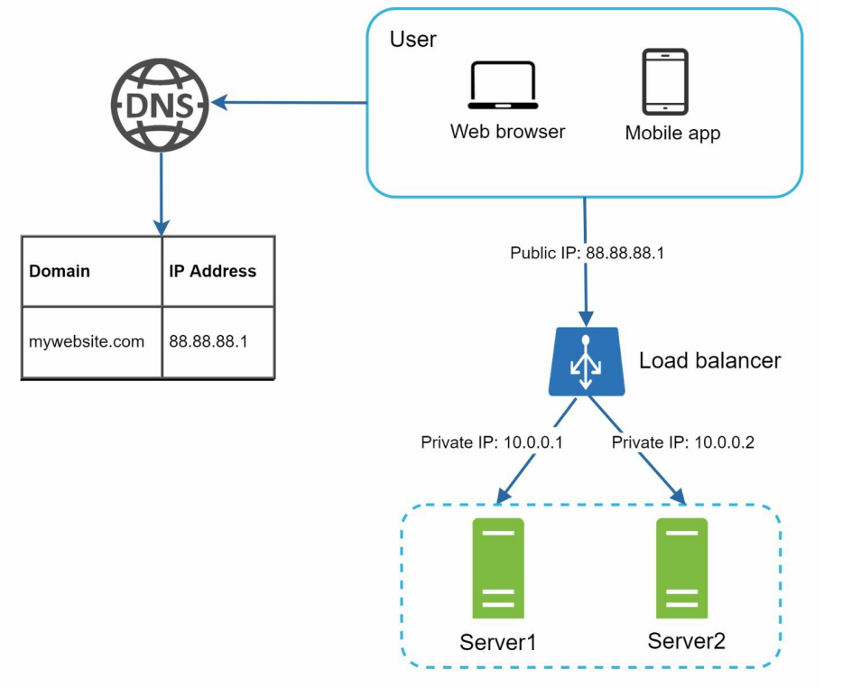
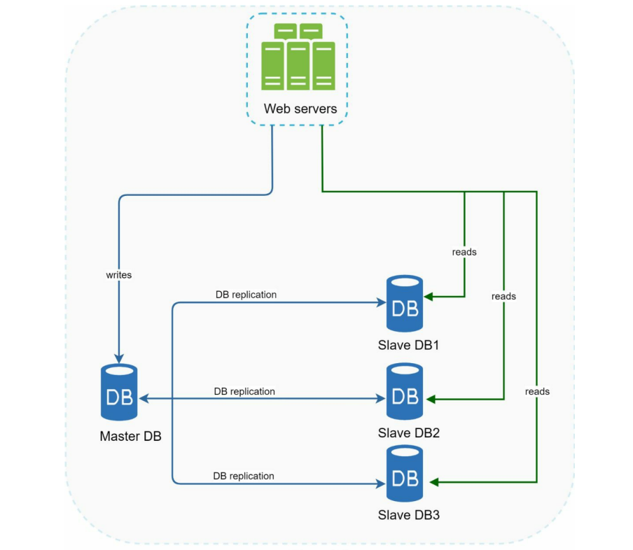
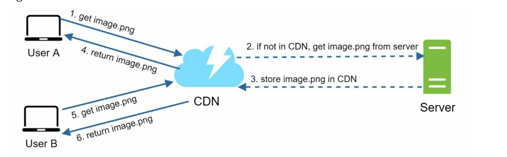
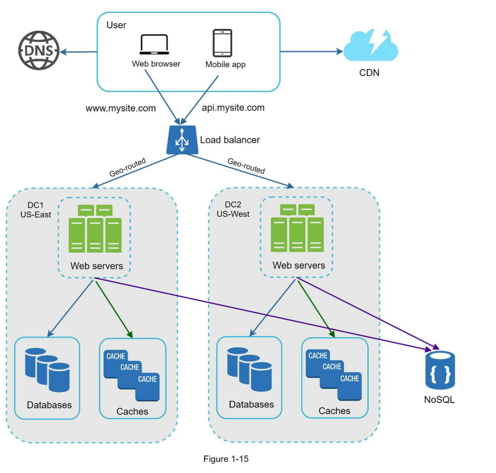
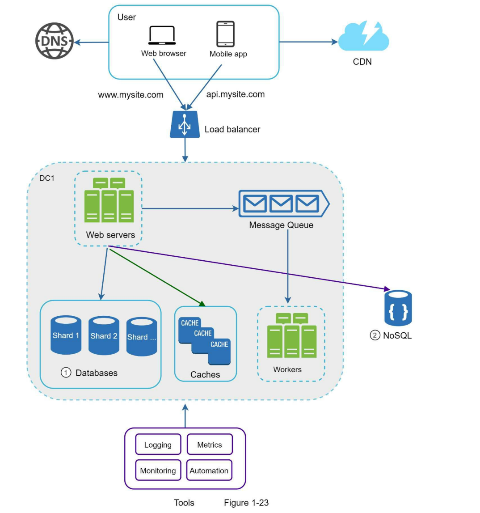

# 从零到百万用户

## 单体服务

什么时候使用非关系型数据库：
- 应用需要低延迟
- 数据不需要结构化的关系型数据
- 需要存储海量的数据

垂直扩容指的是增加服务器的硬件资源，比如CPU、内存等；水平扩容指的是在现有的机器上启多个服务    
垂直扩容和水平扩容：
- 垂直扩容有硬件条件限制，不可能通过无限制的增加CPU和内存到一个服务中
- 如果服务中有个地方出现故障，会导致整个服务挂掉

## 负载均衡服务器

负载均衡服务器的优点有：
1. 安全：避免把服务器直接连到客户端
2. 可靠性：如果一台服务器挂了，所有流量将会到另外一个服务器中
3. 方便扩容：如果流量过大，可以很方便地进行一个水平扩容

## 数据库副本

数据库副本一般有一个主数据库和多个从数据库组成。主数据库一般是用来进行写操作；而从数据库一般用来读操作 

如果某一个从节点挂了，读操作暂时地会直接从主节点读取。只要发现了故障问题，一个新地从节点将会建立，并且取代老的节点；或者说如果从节点有多个可用的话，会从其它从节点获取

如果主节点挂了，某个从节点将会成为新的主节点

数据库副本的好处有：
- 更好的性能：因为所有的写操作都发生才主节点中；读操作发生在从节点中。因为这种主从模式可以同时进行多个查询，因此有助于提高性能
- 可靠性：如果其中某个数据库被台风或地震等自然灾害破坏掉，数据并不会丢失，因为同样的数据存在不同的数据库中，并且这些数据库可以放在不同的位置。
- 高可用：即使某个数据库关闭了，你依然可以通过其它数据库访问到数据

## CDN(内容网络分发)

CDN是一个由分散在各个地理位置的服务器组成的网络，用于传递静态内容，例如图片、视频、CSS或JavaScript等静态资源    

如何使用CDN：
- 成本考虑：CDN一般由第三方提供商提供的，如果把一些不经常使用的内容放在CDN, 无疑会造成资源浪费
- 设置过期时间：过期时间不能设置太长，也不能设置太短
- 回调：当发生错误的时候，客户端能够检查到错误
- 移除不可用文件

## 数据中心

多个数据中心可以防止某个服务挂了，从而导致整个应用起不来。但是这也带来了一些问题：
- 流量重定向：需要用GeoDNS等有效的工具，将网络请求引导到最近的数据中心
- 数据同步：多个数据中心需要保持数据同步，防止某个数据中心挂了，可以从其它数据中心获取到同样的数据
- 测试和部署：需要考虑敏捷迭代测试和部署

## 消息队列

 消息队列是一个存储在内存的持久化组件，支持异步通信。消息队列的工作模式有：
 - 简单模式：一个队列只有一个消费者
 - 工作模式：多个消费者监听同一个队列
 - 发布订阅模式：多个消息队列，每一个消息队列有一个消费者监听
 - 路由模式：一个交换机绑定多个消息队列，每个消息队列都有自己唯一的key，每个消息队列有一个消费者监听

 消息队列的使用场景：
 - 解耦
 - 异步处理
 - 流量削峰
 - 日志处理

 消息队列的缺点：
 - 系统可用性降低
 - 系统复杂度提高
 - 一致性问题

常用的消息队列有
- Kafka: 10万级别的单机吞吐，延迟在ms级别以内；可用性非常好，支持分布式; 可靠性可以做到零丢失
- RabbitMQ：万级，比Kafka、RocketMQ低一个数量级; 可靠性可以做到基本不丢失
- RocketMQ: 10级，支持高吞吐，延迟在ms级别以内；可用性非常好，支持分布式架构；可靠性可以做到0丢失

