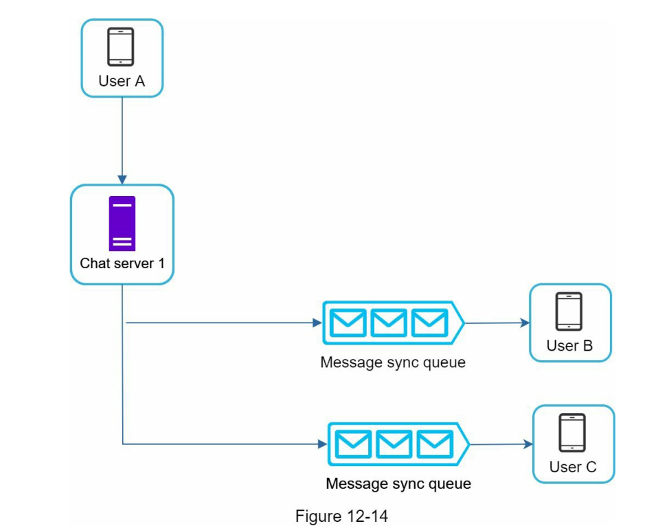

# 聊天系统

1. Chat Servers用于发送和接收消息
2. Presence Servers(状态服务器)维持在线/掉线状态
3. API Servers用于用户登录、注册等信息
4. Notification Servers通知服务器用于推送消息
5. KV store用于存储离线信息，等用户在线的时候，推送历史消息

## 1对1聊天架构

## 群组聊天系统设计
### 小型群聊设计

该设计架构适用于小型群聊，因为：
- 它简化了邮件同步流程，因为每个客户端只需要检查自己的收件箱，即可获得最新消息
- 当群的人数很小时，每个收件人的收件箱存储一份数据，所需的存储不是很大    
微信就是采用类似的方法，每个群最多500个人    

对于接收方用户C来说，他可以同时接收到用户A和用户C的消息

## Presence Server状态服务器设计

### 用户登录
当用户登录之后，客户端和实时服务器采用WebSocket建立了连接，并且把用户状态和last_active_at的时间戳保存在KV存储中

### 用户退出
当用户注销时，先经过API Server，然后通知实时状态服务器，更改KV存储为d掉线状态