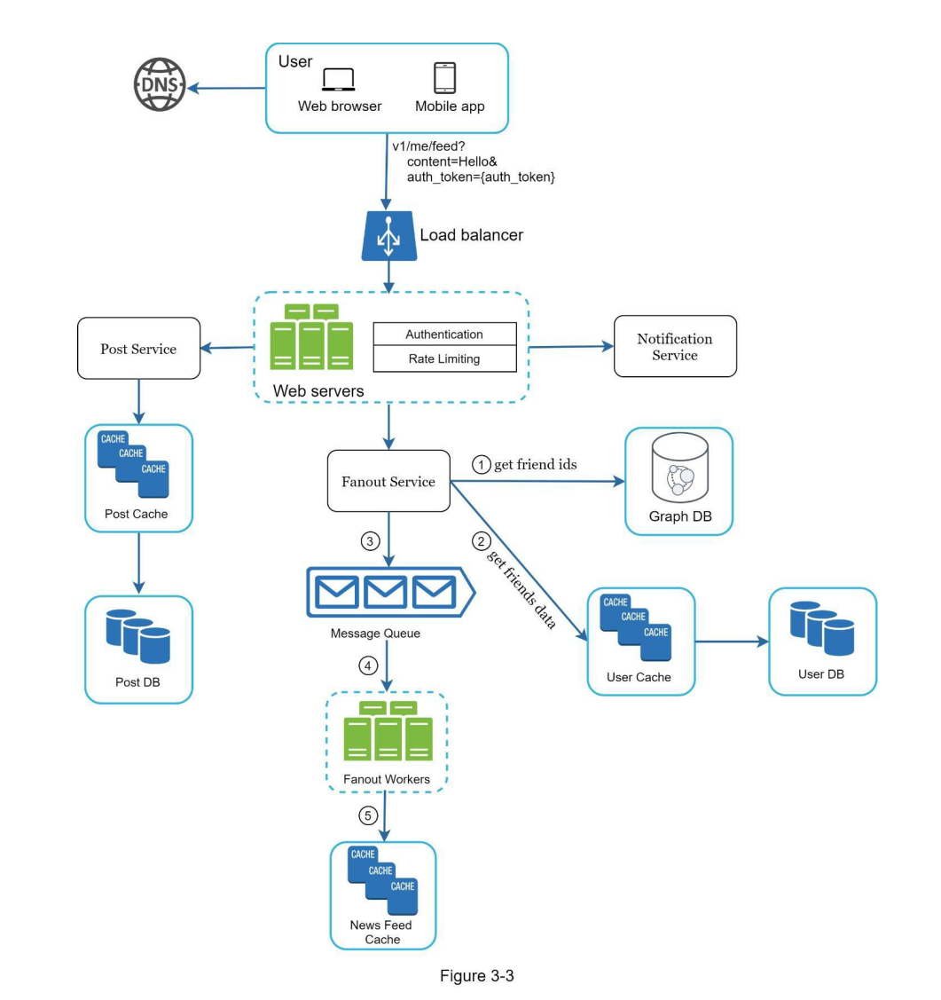
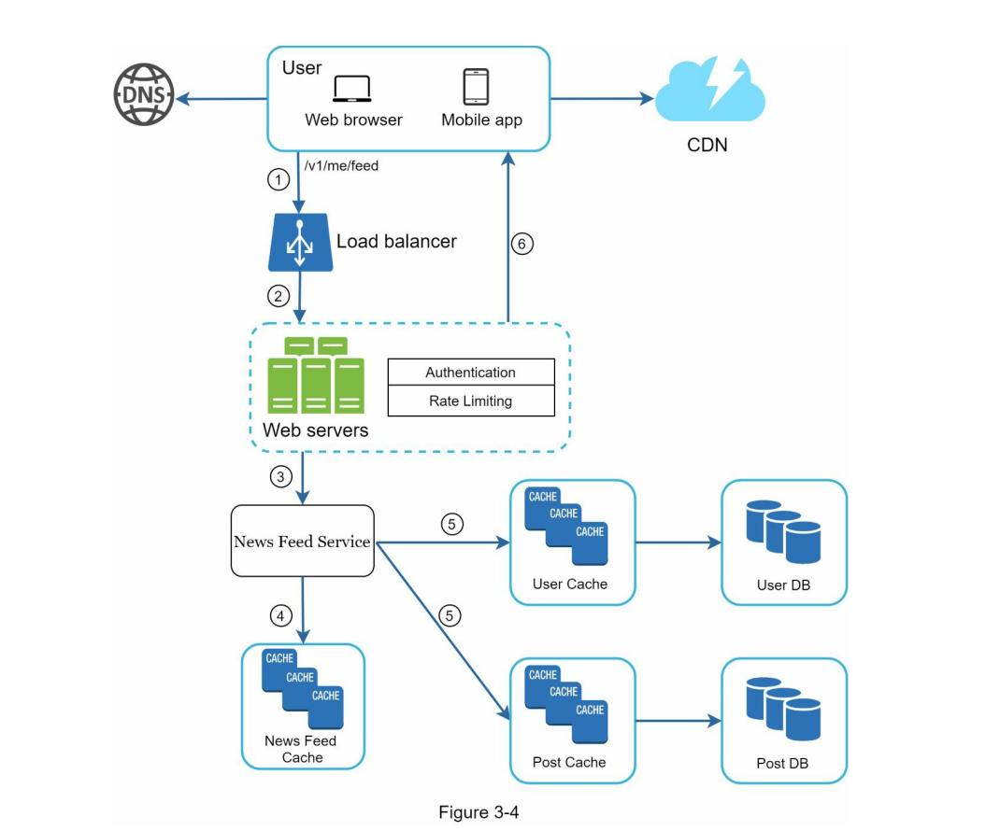

# 系统设计框架(面试技巧)

## 1. 理解问题并且建立设计框架

当面试官要求设计一个系统时，不需要急于给出答案，而是理解基于什么样的场景、什么样的数量级去设计这个系统。下面有几个方向可以询问面试官：
- 针对什么样的功能
- 该系统有多少个用户
- 公司预计扩大的速度有多块
- 公司的技术栈

## 2. 提出高级别的设计并且尝试获得面试官的认可

1. 提出一个初始的设计草稿，并且征求反馈意见。把面试官当作同事一样，很多面试官比较乐意探讨技术问题
2. 在白纸或白板中画出架构草图，比如mobile app, browser, CDN, database, cache, message queue等
3. 进行事后分析，这个系统是否符合要求

## 3. 进行细节深挖

## 4. 总结
最后，面试官可能会和你讨论其它问题，下面有几个方向可以参考：
- 面试官可能会让你分析该系统的一个瓶颈或者潜在问题，永远不要说你的系统是完美的，因为没有什么事情是十全十美的。
- 回顾一下刚才整体的设计过程，并且指出有什么亮点
- 可以讨论服务是否可达，比如说网络问题、服务起不来等
- 日志告警和指标
- 如何处理扩容

在回答的过程中，需要注意的地方有：
- 不要对一些经典的设计毫无了解
- 不要在没有明确要求的情况下，进行解答
- 不要对单个设计，进行过多的细节处理
- 如果陷入困境，需要及时向面试官求助
  