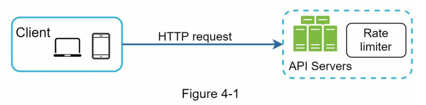
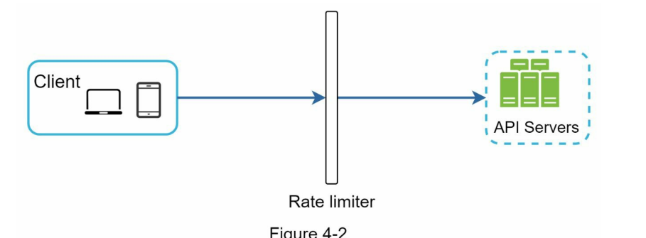
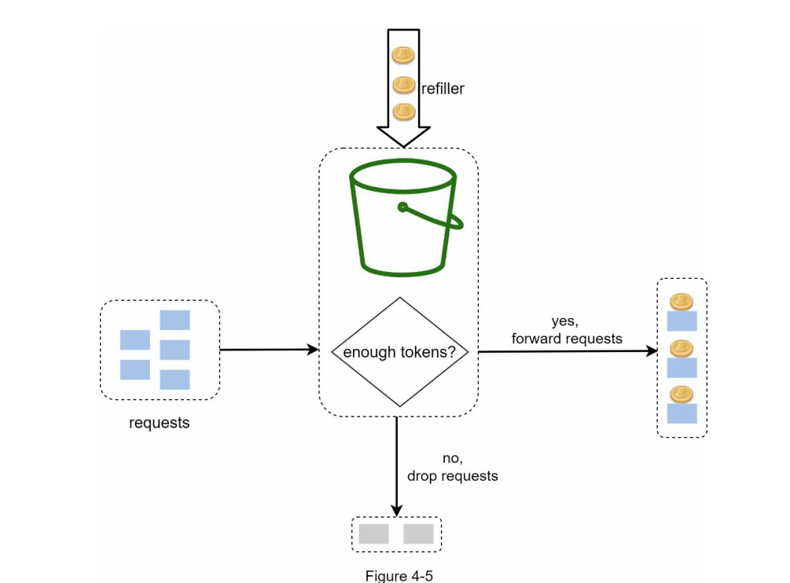
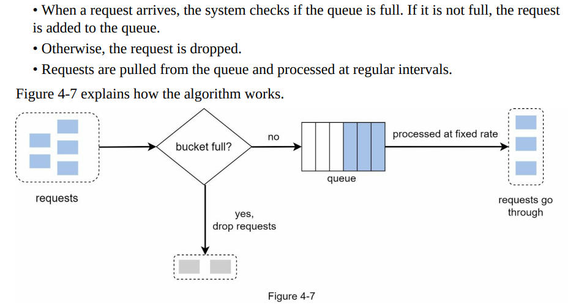
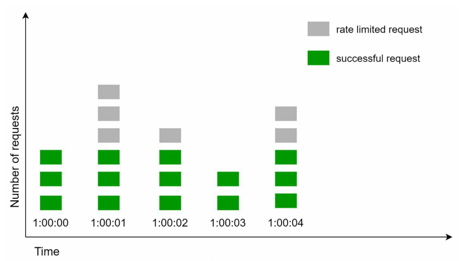
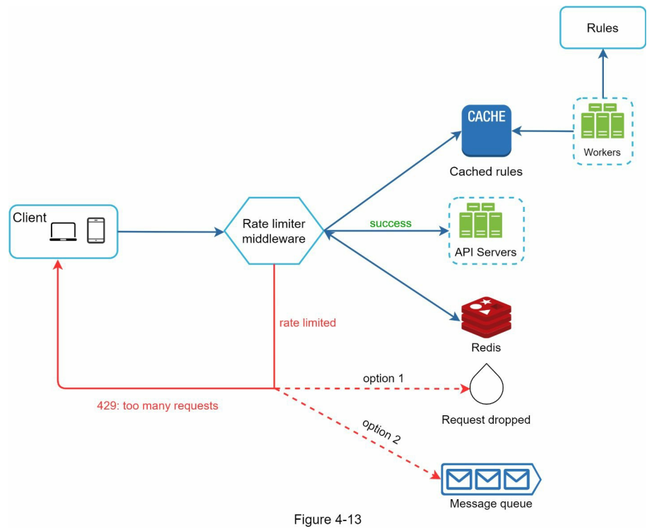
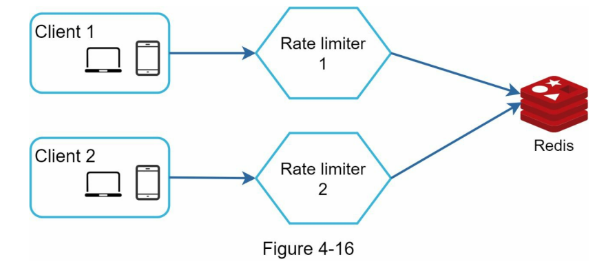

# 限流

## 限流的好处
1. 防止Dos(Denial of Service)攻击
2. 减低成本，特别是使用第三方服务的时候
3. 防止服务器过载

## 在哪里限流
限流可以在客户端、也可以在服务端、还可以在客户端和服务端中间。一般是在服务端或者在客户端和服务端中间，因为在客户端很容易被伪造。





## 限流算法
限流算法有：
- 令牌桶算法
- 漏桶算法
- 固定窗口(也称计数器)
- 滑动窗口日志
- 滑动窗口计数器

### 令牌算法
令牌算法是指系统以一定的速度往令牌桶丢令牌，当一个请求过来的时候，会去令牌桶里申请一个令牌，如果能获取到令牌，那么请求则可以正常进行，反之被丢弃。亚马逊和Strope就是用令牌桶算法


优点：
- 算法简单，只需要两个参数：桶的大小和速率
- 内存高效
- 允许在短时间内爆发流量

缺点：
- 很难改变桶的大小和速率


## 漏桶算法

漏桶算法是指不管请求的数量多少，最终都会以固定的出口流量大小匀速流出，如果请求的流量超过漏桶大小，那么超出的流量将会被丢弃。也就是说流量流入的速度是不固定的，但是流出的速度是恒定的。电子商务公司Shopify就是使用该算法


优点：
- 在队列大小有限的情况下，内存效率高
- 适用于稳定的需要露出率   
 
缺点：
- 突发的流量可能使队列中充满旧请求，如果未处理这些请求，最近的请求将受到速率限制
- 算法中有两个参数。要正确调整它们可能并不容易 

## 固定窗口
固定窗口是指对一个固定的事件窗口内的请求数量进行计数，如果超过请求数量的阈值，将被直接丢弃。


优点:
- 容易理解    

缺点：
- 在某个时间阶段，可能请求流量会激增，这样导致超过允许的请求数量

## 滑动日志
滑动日志是一个比较冷门的限流算法，但是比较好用。滑动日志限流算法需要记录请求的时间戳，通常使用有序集合来存储，我们可以在单个有序集合中跟踪用户在一个时间段内的所有的请求

## 滑动窗口计数

滑动窗口是固定窗口和滑动日志两种算法的结合，就是时间窗口在随着时间推移不停地移动

优点:
- 避免流量突然增大的问题
- 高效存储    

缺点：
- 使用于不那么严格的限流


## 设计架构


```
domain: auth
descriptors:
  - key: auth_type
    Value: login
    rate_limit:
      unit: minute
      requests_per_unit: 5

```

## 限流在分布式系统中的挑战

限流在单体服务中，问题不大，但是在分布式系统中，需要考虑多线程竞态问题和同步问题

### 多线程问题

多线程问题可以采用锁来解决，但是锁会导致系统性能问题；解决的方法可以采用Lua脚本和Redis set数据结构解决

### 同步问题
使用Redis几种存储数据

