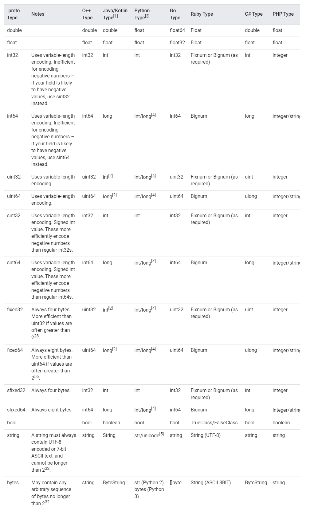

# RPC

rpc(remote procedure call)远程过程调用，简单的来讲就是一个程序调用另外一台服务器的程序的过程，一般用于微服务架构中。

在调用的过程中需要解决一下几个问题： 
1. Call的id映射。

2. 序列化和反序列化。

3. 网络传输。

## RPC开发四大要素
RPC技术在架构设计上有四部分，分别是：客户端、客户端Stub、服务端、服务端Stub

- 客户端Stub: 主要用来存储要调用的服务器地址，同时该程序还负责将客户端请求远端服务器程序的数据信息打包成数据包，通过网络发送给服务端Stub程序；其次，还要接收服务端Stub发送的调用结果数据包，并解析返回给客户端。

- 服务端Stub: 接收客户端Stub程序通过网络发送的请求消息数据包，并调用服务端中真正的程序功能的方法，完成功能调用；其次，将服务端执行调用的结果进行数据处理打包发送给客户段Stub程序


## Protobuf
官方地址：https://developers.google.cn/protocol-buffers/docs/proto3

### Protobuf数据类型


## gRPC是什么

## gRPC实践

1. 首先按照[gRPC官网](https://grpc.io/docs/languages/go/quickstart/)的快速指南来，下载Go安装包[go1.18.4.windows-amd64.msi](https://go.dev/learn/), 配置GOROOT和GOPATH环境变量
2. 下载最新版的[Protocol buffer](https://github.com/protocolbuffers/protobuf/releases),这里最新版的是[protoc-21.2-win64.zip](https://github.com/protocolbuffers/protobuf/releases/download/v21.2/protoc-21.2-win64.zip)， 解压到一个目录，然后配置环境变量
3. 安装Protocol buffer编译插件
```shell
 go install google.golang.org/protobuf/cmd/protoc-gen-go@v1.28
 go install google.golang.org/grpc/cmd/protoc-gen-go-grpc@v1.2
```
安装完成后需要查看是否已经设置了`GOPATH\bin`环境变量
4. 安装grpc
需要用`go mod`管理依赖
```
go get google.golang.org/grpc
```

5. 编写一个简单的`hello.proto`

```
syntax="proto3";


package hello;

message Req {
  string message = 1;
}

message Res {
  string message = 1;
}

service HelloGRPC {
  rpc SayHi(Req) returns (Res);
}
```
6. 编译运行
```
protoc --go_out=. --go_opt=paths=source_relative --go-grpc_out=. --go-grpc_opt=paths=source_relative ./hello.proto
```
遇到第一个问题是无法识别`protoc`命令

查了一下资料，还需要下载单独的`protoc.exe`程序（[下载地址](https://github.com/protocolbuffers/protobuf/releases)），并把`protoc.exe`加入到`GOPATH\bin`目录下


重新执行一下
```
protoc --go_out=. --go_opt=paths=source_relative --go-grpc_out=. --go-grpc_opt=paths=source_relative ./hello.proto
```
发现了另外一个问题
```
Please specify either:
        • a "go_package" option in the .proto source file, or
        • a "M" argument on the command line.

See https://developers.google.com/protocol-buffers/docs/reference/go-generated#package for more information.

```
再google一下，需要在`hello.proto`文件中写入`option go_package="./;hello";`, 这里的`go_package`有两部分组成，一部分是`go mod名称/proto文件所在的路径`；另一部分是`包名` 

## Protocol Buffers
Protocol buffers提供了一种与语言无关、平台中立的可扩展机制，用于序列化数据结构，跟JSON类似，不过它比JSON体积更小、速度更快
### 1. Protocol Buffers类型
Protocol Buffers的数据类型和其它语言类似，有double、float、int类型等，一个message的结构如下。
```js
syntax="proto3"
package tutorial;

import "google/protobuf/timestamp.proto";
option go_package = "github.com/protocolbuffers/protobuf/examples/go/tutorialpb";


message Person {
  string name = 1;
  int32 id = 2;  // Unique ID number for this person.
  string email = 3;

// 枚举类型
  enum PhoneType { 
    MOBILE = 0;
    HOME = 1;
    WORK = 2;
  }
  
// 嵌套另外一个message
  message PhoneNumber {
    string number = 1;
    PhoneType type = 2;
  }

// 数组
  repeated PhoneNumber phones = 4;

// 引用第三方proto文件的message类型: import "google/protobuf/timestamp.proto";
  google.protobuf.Timestamp last_updated = 5;
}

// Our address book file is just one of these.
message AddressBook {
  repeated Person people = 1;
}
```

Protocol Buffers与其它语言类型的映射关系

**默认值**
Protocol Buffers在解析message结构的时候，如果编码中不赋值的话，则将该message对象中的相应字段设置为该字段的默认值。
- string的默认值为"",
- bytes的默认值为空字节
- bool的默认值为false
- number的默认值为0
- enum的默认值为第一个定义的枚举值，该值必须为0
- message的默认值取决于编译的语言类型

### 2.option go_package
**go_package**有两部分组成，一部分是`proto生成后的文件需要放在哪个目录下`， 另一部分是`包名`    

例如:将proto生成的`pb.go`文件放在`相对于hello.proto文件的./hello/proto目录下`
```
// hello_grpc/proto/hello.proto
syntax="proto3";

package hello;

option go_package="hello/proto;hello";

message Req {
  string name = 1;
}

message Resp {
  string message = 1;
}

service Greeter {
  rpc SayHello (Req) returns(Resp);
}
```
执行`protoc -I . hello.proto --go-grpc_out=. --go_out=.`后，生成的目录如下

    

如果想放根目录下的common目录，`go_package="../../common/hello/proto;hello"`
生成的目录就变成了


package的详细说明可以看[官网的package说明](https://developers.google.com/protocol-buffers/docs/reference/go-generated#package)

### 3. 引用其它proto文件
- 引入同一个包下的不同文件的proto
```
// grpcdemo/hello_grpc/proto/hello.proto

syntax="proto3";

package hello;

option go_package=".;hello";

// 引入ping.proto文件, 这里import不能使用相对路径，例如: "./ping.proto"
import "ping.proto"; 

message Req {
  string name = 1;
}

message Resp {
  string message = 1;
}

service Greeter {
  rpc SayHello (Req) returns(Resp);
}

service PingPong {
  rpc Ping(Empty) returns(Pong);
```

```
// grpcdemo/hello_grpc/proto/ping.proto

syntax="proto3";

package hello;

option go_package=".;hello";

message Empty{}

message Pong {
  string name = 1;
}
```
在`grpcdemo/hellogrpc/proto`目录下, 先后执行`protoc -I ping.proto --go_out=.`和`protoc -I hello.proto --go_out=.`即可

- 引入不同文件的不同包的proto
```
// grpcdemo/hello_grpc/proto/hello/hello.proto

syntax="proto3";


package hello;

option go_package="./;hello";

// 这里导入的是从项目根目录开始的绝对路径
import "grpcdemo/hello_grpc/proto/ping/ping.proto";

message Req {
  string name = 1;
}

message Resp {
  string message = 1;
}

service Greeter {
  rpc SayHello (Req) returns(Resp);
}

//service PingPong {
//  rpc Ping(ping.Empty) returns(ping.Pong);
//}

message PingPong{
  optional ping.Pong pingtest = 1;
}
```
```
// grpcdemo/hello_grpc/proto/ping/ping.proto
syntax="proto3";

package ping;

option go_package=".;ping";

message Empty{}

message Pong {
  string name = 1;
}
```
先在`grpcdemo/hello_grpc/proto/ping`目录下执行`protoc -I . ping.proto --go_out=.`生成`ping.pb.go`文件，然后在`grpcdemo/hello_grpc/proto/hello`目录下执行`protoc -I ../../../../ -I ./hello --go_out=. *.proto `

需要注意的是`-I`表示从项目根目录开始，一层一层找到项目的根目录执行

## GRPC四种数据流模式

1. 简单模式(Simple RPC)
2. 服务端数据流模式(Server-side streaming RPC): 这种模式是客户端发起一次请求，服务端返回一段连续的数据流。典型的例子是股票交易

3. 客户端数据流模式(Client-side stream RPC): 与服务端数据流模式相反，客户端源源不断的向服务端发送数据流，发送结束后，服务端返回一个相应。典型的例子是物联网终端向服务器报送数据

4. 双向数据流模式(Bidirectional stream RPC): 客户端和服务端都可以向对方发送数据流，这个时候双方的数据可以同时互相发送，也就是实现实时交互。典型的例子就是聊天机器人。


## demo
1. 新建stream.proto文件
```
//stream_grpc/proto/stream.proto 

syntax = "proto3";

package stream;

option go_package = "./;stream";

message StreamReqData {
  string data = 1;
}

message StreamResData {
  string data = 1;
}


service Greeter {
  rpc GetStream(StreamReqData) returns(stream StreamResData); // 服务端流模式
  rpc PostStream(stream StreamReqData) returns(StreamResData); // 客户端流模式
  rpc AllStream(stream StreamReqData) returns(stream StreamResData); // 双向数据流模式
}
```
2. 创建服务端
```
// stream_grpc/server/server.go

package main

import (
	"fmt"
	"google.golang.org/grpc"
	stream "grpcdemo/stream_grpc/proto"
	"net"
	"sync"
	"time"
)

const PORT = ":8888"

type server struct {
	stream.UnimplementedGreeterServer
}

func (s *server) GetStream(req *stream.StreamReqData, res stream.Greeter_GetStreamServer) error {
	i := 0
	for {
		i++
		res.Send(&stream.StreamResData{
			Data: fmt.Sprintf("%v", time.Now().Unix()),
		})
		time.Sleep(time.Second)
		if i > 10 {
			break
		}

	}
	return nil
}

func (s *server) PostStream(cliStr stream.Greeter_PostStreamServer) error {
	for {
		if a, err := cliStr.Recv(); err != nil {
			fmt.Println(err)
			break
		} else {
			fmt.Println(a.Data)
		}
	}
	return nil
}

func (s *server) AllStream(allStr stream.Greeter_AllStreamServer) error {
	wg := sync.WaitGroup{}
	wg.Add(2)
	go func() {
		defer wg.Done()
		for {
			data, _ := allStr.Recv()
			fmt.Println("收到客户端消息: " + data.Data)
		}
	}()

	go func() {
		defer wg.Done()
		for {
			allStr.Send(&stream.StreamResData{Data: "我是服务器"})
			time.Sleep(time.Second)
		}
	}()

	wg.Wait()
	return nil
}

func main() {
	s := grpc.NewServer()
	stream.RegisterGreeterServer(s, &server{})
	listener, err := net.Listen("tcp", PORT)
	if err != nil {
		panic(err)
	}
	s.Serve(listener)
}

```

3. 创建客户端

```
// stream_grpc/client/client.go

package main

import (
	"context"
	"fmt"
	"google.golang.org/grpc"
	stream "grpcdemo/stream_grpc/proto"
	"sync"
	"time"
)

func main() {
	conn, err := grpc.Dial("127.0.0.1:8888", grpc.WithInsecure())
	if err != nil {
		return
	}
	client := stream.NewGreeterClient(conn)

	//服务端数??据流
	res, _ := client.GetStream(context.Background(), &stream.StreamReqData{Data: "choi"})
	for {
		a, err := res.Recv()
		if err != nil {
			fmt.Println(err)
			break
		}
		fmt.Println(a.Data)
	}

	// 客户端数据流
	putS, _ := client.PostStream(context.Background())
	i := 0
	for {
		i++
		err := putS.Send(&stream.StreamReqData{
			Data: fmt.Sprintf("choi %d", i),
		})
		if err != nil {
			return
		}
		time.Sleep(time.Second)
		if i > 10 {
			break
		}
	}

	// 双向模式
	allStr, _ := client.AllStream(context.Background())
	wg := sync.WaitGroup{}
	wg.Add(2)
	go func() {
		defer wg.Done()
		for {
			data, _ := allStr.Recv()
			fmt.Println("收到服务器消息: " + data.Data)
		}
	}()

	go func() {
		defer wg.Done()
		for {
			allStr.Send(&stream.StreamReqData{Data: "我是客户端"})
			time.Sleep(time.Second)
		}
	}()

	wg.Wait()
}

```
分别启动server.go和client.go程序，可以看到如下

```
// client.go
...
1663997151
1663997152
EOF
收到服务器消息: 我是服务器
收到服务器消息: 我是服务器
收到服务器消息: 我是服务器
...


// server.go
...
choi 10
choi 11
收到客户端消息: 我是客户端
收到客户端消息: 我是客户端
收到客户端消息: 我是客户端
...

```


## 参考链接

   

[gRPC详解](https://www.jianshu.com/p/9c947d98e192)